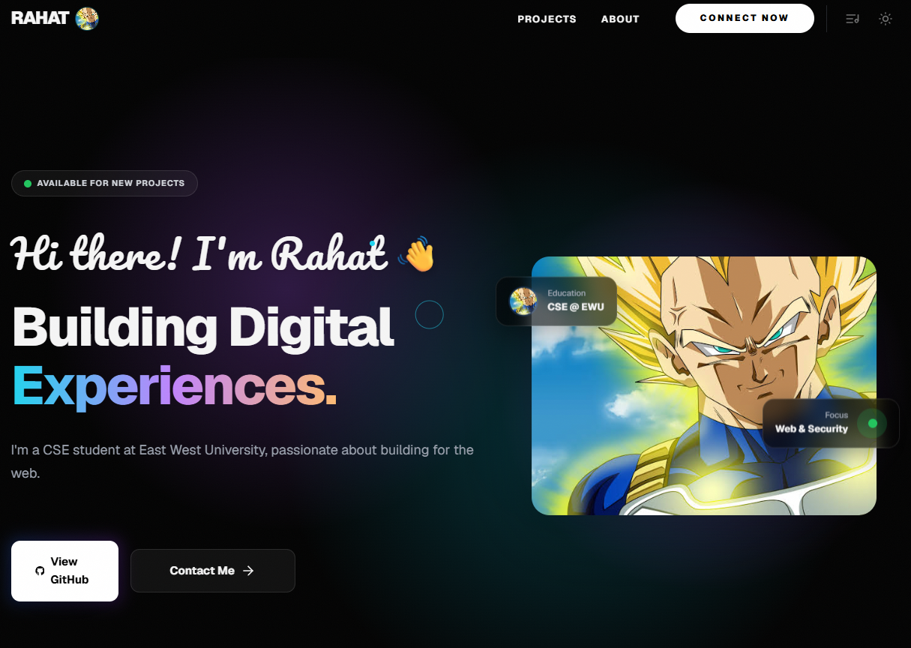

<div align="center">

  # ✦ Mahamudol Hasan Rahat — Personal Portfolio ✦

  <p align="center">
    <strong>A high-performance, award-grade developer portfolio built from scratch with pure HTML, CSS, and JavaScript.</strong>
  </p>

  <p align="center">
    <a href="https://rahat69x.vercel.app/" target="_blank">
      
    </a>
    
    
  </p>

  <br />

  

</div>

---

## ✦ Overview

This repository houses the source code for my personal developer portfolio website. Built without heavy frameworks, bundlers, or build tools, the site delivers a rich, interactive digital experience with sub-second load times, fluid physics-based animations, and custom audio-visual interactions.

* **Live URL:** [rahat69x.vercel.app](https://rahat69x.vercel.app/)
* **Author:** Mahamudol Hasan Rahat (CSE @ East West University)
* **GitHub:** [@Rahat69x](https://github.com/Rahat69x)

---

## ✦ Key Features

### 🎨 1. Adaptive Theme Engine
* Seamless **Dark Mode** & **Light Mode** toggle.
* Synchronized across sessions using `localStorage`.
* Inline pre-paint script eliminates theme-switch flickering (FOUC).

### 🎵 2. Dual-Engine Ambient Soundscape
* Plays a relaxing lo-fi ambient audio track with smooth volume fade in/out.
* **Built-in Fallback Synth**: If the audio file fails or cannot load, an onboard **Web Audio API** multi-oscillator chord generator kicks in automatically.

### ✦ 3. Interactive Canvas Particle Signature
* An interactive HTML5 `<canvas>` wordmark at the bottom of the page.
* Text geometry is rasterized and converted into physics-driven particles that repel smoothly around the user's cursor.

### 📜 4. Motion & Scroll Dynamics
* **Inertia Smooth Scrolling**: Native-feel custom wheel and touch scrolling.
* **3D Showcase Tilt**: Cards track mouse position with dynamic 3D perspective transforms.
* **Sticky Stack Grid**: Interactive skills and tools section that fans out dynamically based on scroll position.
* **Parallax Ambient Blobs**: Multi-layered background lighting effects that drift relative to scroll depth.

### ⌨️ 5. Live Typing & Boot Sequence
* Terminal boot-up sequence on first visit with session memory.
* Continuous typewriter effect cycling through roles and aspirations.
* Full respect for `prefers-reduced-motion` accessibility preferences.

### 📱 6. Responsive & Accessible
* Mobile-first responsive layout with glassmorphic mobile navigation.
* Semantic HTML5 landmark tags, ARIA attributes, and keyboard navigation support.
* Complete OpenGraph & Twitter card meta tags for rich social sharing previews.

---

## ✦ Technology Stack

| Technology | Purpose |
| :--- | :--- |
| **HTML5** | Semantic structure, accessible landmarks, OpenGraph metadata |
| **CSS3 (Vanilla)** | Custom property design system, CSS Grid/Flexbox, glassmorphism, keyframes |
| **JavaScript (ES6+)** | IntersectionObserver, Web Audio API, Canvas 2D Context, DOM events |
| **Google Fonts** | `Geist`, `Geist Mono`, `Pacifico`, `Monoton` |
| **Hosting** | [Vercel](https://vercel.com) |

---

## ✦ Project Structure

```
my-profile/
├── index.html               # Main website entry point
├── style.css                # Global styles, variables, typography & layout
├── script.js                # Core interactions, theme, audio, and canvas physics
├── README.md                # Documentation
├── assets/
│   ├── ambient.mp3          # Lo-fi ambient background music
│   └── og.jpg               # Social preview OpenGraph image
└── images/
    ├── Thats my bulma.jpg   # Profile avatar and hero portrait
    ├── portfolio.png        # Portfolio website screenshot
    ├── kothabarta.png       # KothaBarta platform screenshot
    └── leafhealthai.png     # LeafHealth AI screenshot
```

---

## ✦ Getting Started Locally

No package manager, dependencies, or build step required.

1. **Clone the repository:**
   ```bash
   git clone https://github.com/Rahat69x/rahat.git
   cd rahat
   ```

2. **Open in browser:**
   * Double-click `index.html` to open it in your browser, or:
   * Use VS Code's **Live Server** extension for local hot-reloading.

---

## ✦ Author

**Mahamudol Hasan Rahat**
* **University:** East West University (B.Sc. in CSE)
* **Focus:** Web Development & Cybersecurity
* **Email:** [rahat4528.univ@gmail.com](mailto:rahat4528.univ@gmail.com)
* **WhatsApp:** [+880 164 183 4481](https://wa.me/8801641834481)
* **Telegram:** [+880 164 183 4481](https://t.me/+8801641834481)
* **GitHub:** [@Rahat69x](https://github.com/Rahat69x)
* **Website:** [rahat69x.vercel.app](https://rahat69x.vercel.app)

---

## ✦ License

This project is open-source and available under the [MIT License](LICENSE).
